# Rapport de sécurité – Formulaire sécurisé

## 1. Objectif

Mettre en place un formulaire de contact sécurisé en environnement local, en appliquant les principes de sécurité suivants :

* Utilisation de HTTPS
* Protection contre les attaques XSS, CSRF et injections
* Authentification utilisateur
* Session sécurisée
* Captcha Google reCAPTCHA

---

## 2. Mesures de sécurité mises en œuvre

### Authentification utilisateur

* Page de connexion `login.html`
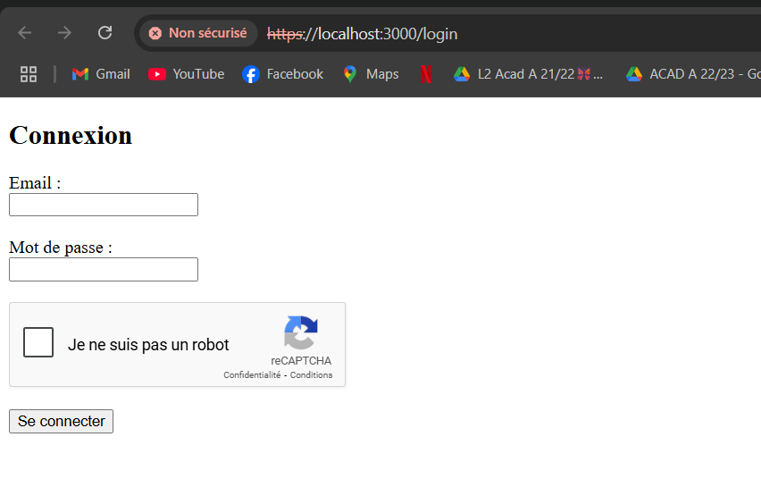

* Vérification de l'identité via un mot de passe haché (bcrypt)
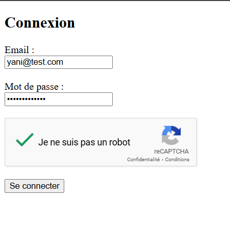
* Session stockée avec `express-session`
* Accès au formulaire uniquement après connexion
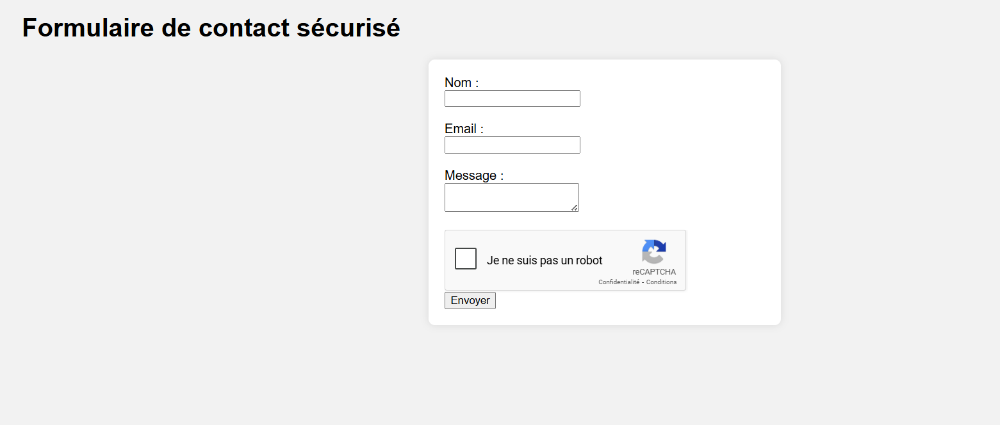
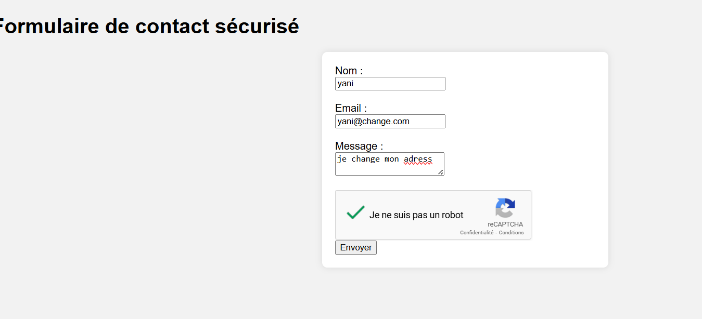
* La bonne reception du formulaire
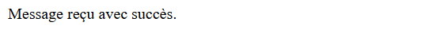

### Captcha Google reCAPTCHA

* Intégré au formulaire avec une clé de test (v2)
* Vérification serveur via API Google
* Protection contre les robots et les soumissions automatisées

### Sécurité des sessions

* Utilisation de cookies avec :
  * `HttpOnly: true`
  * `SameSite: 'strict'`
  * `Secure: true` (activé automatiquement en production)
* Sessions générées uniquement après authentification

### Sécurité des données

* Tous les messages sont hachés via `bcrypt`
* Aucun mot de passe ni message en clair n’est stocké
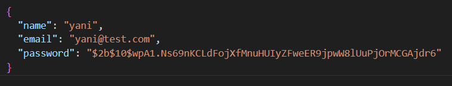
* Les messages sont enregistrés dans un fichier `messages.json` sécurisé
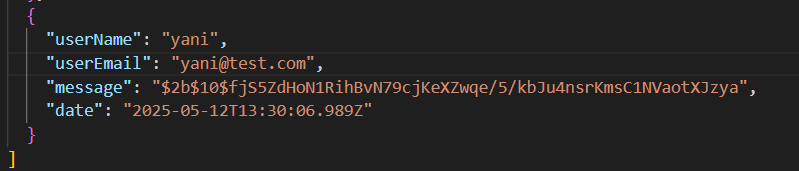
* Un log d’accès est maintenu dans `logs/access.log`
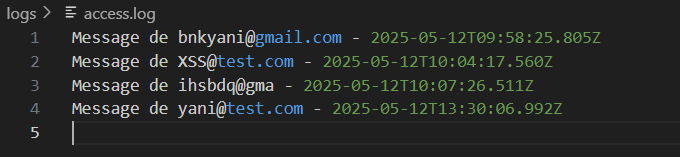

### Sécurisation des en-têtes HTTP

* Utilisation de `helmet` pour :

  * Forcer les headers sécurisés
  * Désactiver temporairement CSP pour laisser passer reCAPTCHA (en local)

### HTTPS activé

* Serveur lancé via `https.createServer()`
* Utilisation d’un certificat auto-signé (`key.pem` / `cert.pem`)
* Connexion locale sécurisée sur `https://localhost:3000`
*  Le certificat auto-signé utilisé en local ne peut pas être considéré comme sécurisé dans un environnement de production, car il n’est pas vérifié par une autorité de certification reconnue.
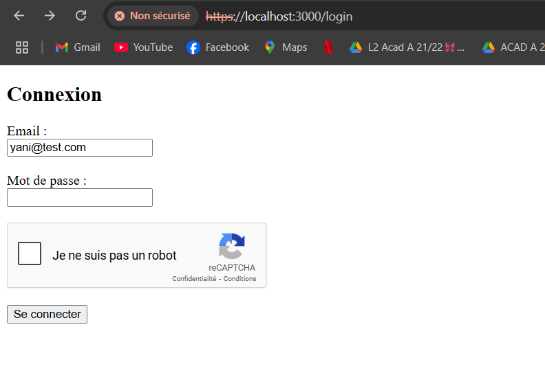
---

## 3. Tests réalisés

###  Test XSS

* Insertion de `` dans le message
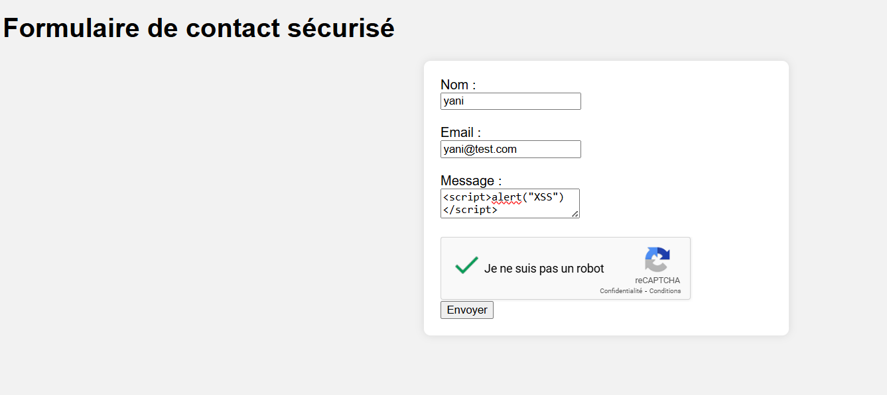
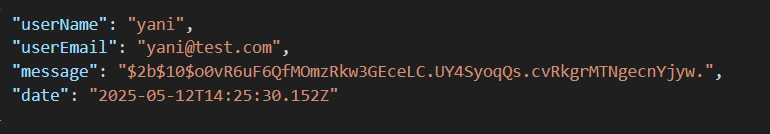
*  Résultat : non exécuté (haché), protection effective
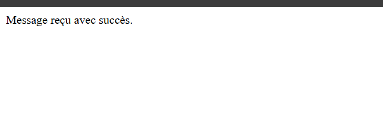

### Test d’injection SQL

* Insertion de `' OR 1=1; --` dans les champs
*  Résultat : aucune base SQL utilisée, pas d'effet possible
###  Vérification des cookies dans DevTools

*  `HttpOnly` ✔️
*  `SameSite` ✔️
*  `Secure` (via `NODE_ENV=production`)
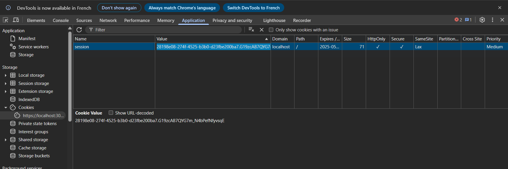

### Vérification TLS

* Navigateur : cadenas affiché (certificat auto-signé)
* Protocole TLS actif confirmé via DevTools > Network > Security

---

## 4. Conclusion

Le formulaire est entièrement sécurisé pour un usage local, conforme aux bonnes pratiques OWASP. Il empêche les attaques courantes (XSS, robots, brute force) et respecte les principes de sécurité by design. Il est prêt pour une mise en ligne avec des clés reCAPTCHA réelles et un certificat SSL valide.
